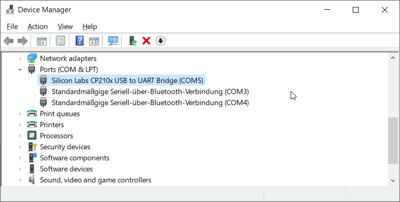

# Einleitung

Wir benutzen einen ESP32-Mikrokontroller auf dem die Software [Micropython](https://micropython.org/) läuft. Ein Mikrocontroller kann meist für verschiedene kleine Anwendungen eingesetzt werden. 
Der ESP hat zB durch WLAN und Bluetooth sehr viele Einsatzmöglichkeiten. Die Programmierung per Micropython soll dabei den Einstieg besonders leicht machen.

Hier gibt es eine Dokumentation für die Programmierung verschiedener Schnittstellen des ESP: https://docs.micropython.org/en/latest/esp32/quickref.html

Hier ist die Dokumentation der Anschlüsse (Pinout): https://cdn.shopify.com/s/files/1/1509/1638/files/ESP-32_NodeMCU_Developmentboard_Pinout.pdf?v=1609851295

Hier gibt es eine etwas ausfühlichere Alternative zu dieser Doku: https://microcontrollerslab.com/getting-started-thonny-micropython-ide-esp32-esp8266/

# Anschluss

Das Mikrokontroller-Board wird einfach per Micro-USB-Kabel mit dem PC verbunden. Die Verbindung läuft über eine serielle Schnittstelle. Auf Windows wird meist dieser Treiber benötigt: https://www.silabs.com/documents/public/software/CP210x_Universal_Windows_Driver.zip

Wenn das Board angeschlossen wird und der Treiber installiert ist, sollte es ungefähr so im Gerätemanager aussehen:



Wenn sich nix tut beim Anschließen ist es höchst wahrscheinlich nur ein USB-Ladekabel und du brauchst ein anderes Kabel.

## LED-Streifen anschließen
| LED-Streifen | ESP |
| --- | ----------- |
| GND | GND |
| +5V | V5 |
| Din | G4 (die meisten anderen GPIOs würden auch funktionieren) |


# Installation Micropython

Falls Micropython noch nicht installiert ist, kann bspw. über den Browser (Chrome/Chromium/Edge) mit diesem Online-Tool installiert werden: https://bipes.net.br/flash/esp-web-tools/

Ansonsten die Firmware [hier herunterladen](https://micropython.org/resources/firmware/esp32-20220117-v1.18.bin) und per [ESP-Tool](https://pypi.org/project/esptool/) flashen mit 
```
esptool.py --chip esp32 --port /dev/ttyUSB0 --baud 460800 write_flash -z 0x1000 ./esp32-20220117-v1.18.bin
```

## erste Kommunikation
Zum Testen ob Micropython installiert ist und funktioniert kann man sich per Seriell-Terminal-Programm (auf Windows bspw. [Putty](https://www.putty.org/)) mit der Baudrate `115200` mit dem Mikrocontroller verbinden. Es sollte eine Python-Konsole zu sehen sein - nach Eingabe von [Enter] kommt dieser Prompt:
```
>>>
```
in dem man bspw mal `help()` ausführen kann. Danach sollte es einen längeren Hilfetext zu Micropython geben:

```
>>> help()
Welcome to MicroPython on the ESP32!
...
```

# Entwicklungsumgebung
Wir nutzen als einfache Entwicklungsumgebung [Thonny](https://thonny.org/). Hier ist Micropython-Support direkt integriert.

Im Menü unter `Tools->Options...->Interpreter` bitte `Micropython (ESP32)` einstellen. Unter Port den seriell Port (zB COM5 unter Windows) auswählen.

Thonny kann Dateien auf dem ESP ausführen. Dazu einfach in der Toolbar `Run current script (F5)` klicken.

Thonny kann Dateien auf dem ESP direkt speichern. Wenn der ESP angeschlossen ist und man `File->Save` auswählt, fragt Thonny nach ob sie auf dem `Micropython device` gespeichert werden soll. 

# Beispielprogramme

## Anschalten einer LED
```python
from machine import Pin
from neopixel import NeoPixel

pin = Pin(4, Pin.OUT)
np = NeoPixel(pin, 10)
np[1] = (20,0,20)
np.write()
```

## Einfaches Lauflicht
```python
from machine import Pin
from neopixel import NeoPixel
from time import sleep

pin = Pin(4, Pin.OUT)
np = NeoPixel(pin, 10)
black_off = (0,0,0)
color_on = (20,20,0)

iLed = 0

while True:
    for i in range(len(np)):
        np[iLed] = black_off
        iLed += 1
        if iLed > len(np):
            iLed = 0
        np[iLed] = color_on
        np.write()
        sleep(0.1)
```
